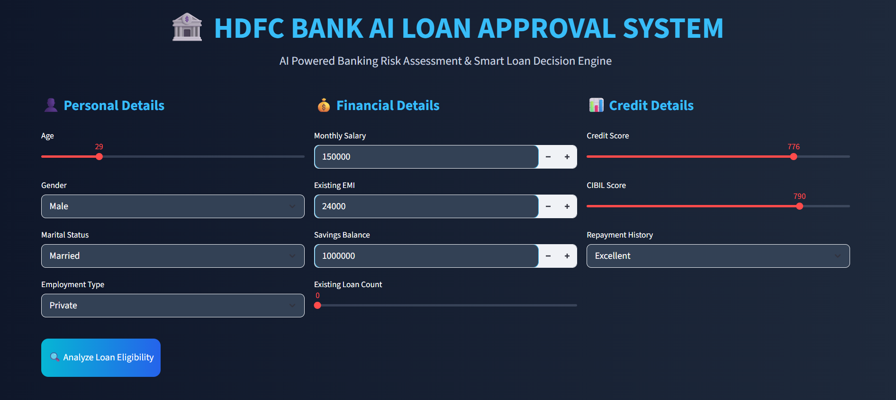
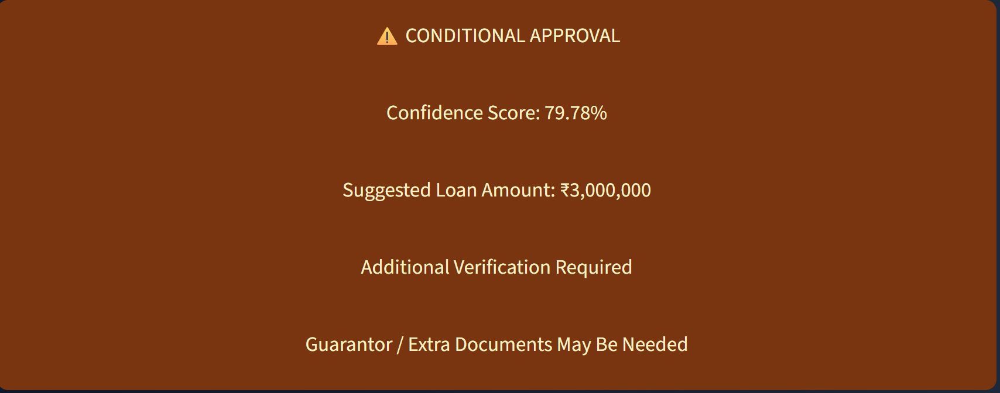
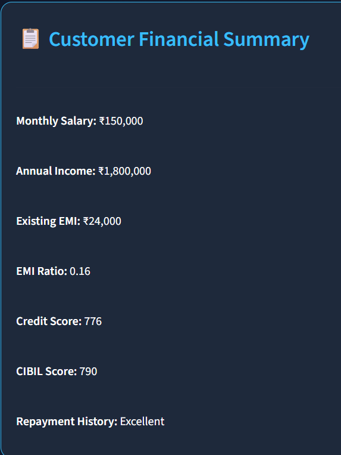

# 🏦 HDFC Bank AI Loan Approval System

An AI-powered banking risk assessment and loan approval prediction system developed using Machine Learning and Streamlit.

This project simulates a realistic Indian banking loan approval workflow using customer financial data, credit behavior, repayment history, liabilities, and risk analysis.

# 🌐 Live Application

## 🚀 Streamlit Deployment

[👉 Open HDFC Bank AI Loan Approval System](https://hdfc-bank-ai-loan-approval-system.streamlit.app/)

Direct Link:

https://hdfc-bank-ai-loan-approval-system.streamlit.app/

The system predicts:

* ✅ Loan Approved
* ⚠️ Conditional Approval
* ❌ Loan Rejected

along with:

* Confidence Score
* Suggested Loan Amount
* Risk Assessment
* Financial Summary

---
# 📸 Application Preview

## 🏦 Main Application UI



---

## ⚠️ Loan Prediction Output



---

## 📊 Customer Financial Summary




# 🚀 Project Features

## ✅ AI-Powered Loan Approval Prediction

Predicts customer loan eligibility using:

* Credit Score
* CIBIL Score
* Salary
* Existing EMI
* Savings Balance
* Repayment History
* Employment Type
* Existing Loan Count

---

## ✅ Smart Banking Risk Assessment

The model evaluates:

* Financial stability
* Debt burden
* Creditworthiness
* Repayment behavior
* Banking trust score

to generate realistic banking decisions.

---

## ✅ Confidence Score Prediction

The application provides:

* prediction probability
* confidence percentage
* decision reliability

similar to real banking AI systems.

---

## ✅ Dynamic Loan Decision Engine

The system intelligently generates:

* Full Approval
* Partial Approval
* Conditional Approval
* Rejection

based on:

* prediction class
* confidence score
* customer risk profile

---

## ✅ Suggested Loan Amount Estimation

The app automatically estimates:

* eligible loan amount
* reduced loan eligibility
* risk-based recommendations

using customer financial capacity.

---

# 📌 Problems Solved By This Project

## 🔹 Manual Loan Verification Delay

Traditional loan approval processes take:

* time
* manpower
* document verification effort

This AI system automates the initial screening process.

---

## 🔹 Human Bias in Loan Decisions

Manual approvals can be inconsistent.

The ML model provides:

* standardized decisions
* data-driven approvals
* consistent risk evaluation

---

## 🔹 High-Risk Customer Detection

The system identifies:

* risky customers
* high EMI burden
* poor repayment behavior
* weak credit profiles

before approval.

---

## 🔹 Faster Banking Risk Assessment

Banks can quickly analyze:

* customer repayment capability
* financial health
* creditworthiness

within seconds.

---

## 🔹 Improved Customer Experience

Customers receive:

* instant eligibility prediction
* confidence score
* loan amount suggestions
* faster response time

through a clean and responsive UI.

---

# 🎯 Benefits of This Application

## ✅ Faster Loan Processing

Reduces loan approval analysis time significantly.

---

## ✅ AI-Based Decision Making

Uses Machine Learning instead of only manual verification.

---

## ✅ Realistic Banking Workflow

Simulates:

* Indian banking systems
* fintech approval pipelines
* loan risk assessment engines

---

## ✅ Financial Risk Reduction

Helps reduce:

* loan defaults
* risky approvals
* repayment failures

---

## ✅ User-Friendly Interface

Built with:

* responsive Streamlit UI
* clean fintech design
* interactive sliders and inputs

---

## ✅ Portfolio-Ready End-to-End ML Project

This project demonstrates:

* Data Science
* Machine Learning
* Feature Engineering
* Classification Models
* Hyperparameter Tuning
* Streamlit Deployment
* Model Interpretation
* Banking Domain Knowledge

---

# 🧠 Machine Learning Workflow

## ✔️ Data Collection

Generated realistic Indian banking loan dataset.

---

## ✔️ Exploratory Data Analysis (EDA)

Performed:

* distribution analysis
* correlation analysis
* risk analysis
* outlier detection
* imbalance checking

---

## ✔️ Data Preprocessing

Applied:

* missing value handling
* feature encoding
* outlier treatment
* feature engineering

---

## ✔️ Model Training

Used:

* Random Forest Classifier
* Hyperparameter Tuning
* GridSearchCV
* Train-Test Split

---

## ✔️ Model Deployment

Deployed using:

* Streamlit
* Joblib
* Interactive UI

---

# 📊 Technologies Used

| Technology    | Purpose                |
| ------------- | ---------------------- |
| Python        | Core Programming       |
| Pandas        | Data Analysis          |
| NumPy         | Numerical Computing    |
| Matplotlib    | Visualization          |
| Seaborn       | Statistical Plots      |
| Scikit-learn  | Machine Learning       |
| Random Forest | Classification Model   |
| GridSearchCV  | Hyperparameter Tuning  |
| Streamlit     | Web Application        |
| Joblib        | Model Saving & Loading |

---

# 📂 Project Structure

```text
loan_approval_system/
│
├── app.py
├── loan_approval_model.pkl
├── loan_dataset.csv
├── requirements.txt
├── code.ipynb
├── emi_predictions.csv
├── loan_approval_predictions.csv
└── README.md
```

---

# ⚡ Future Improvements

* EMI Prediction System
* Interest Rate Prediction
* Loan Amount Regression Model
* Explainable AI (XAI)
* SHAP Feature Importance
* Database Integration
* User Authentication
* Cloud Deployment
* Real-Time Banking Dashboard

---

# 📌 Real-World Use Cases

This system can be adapted for:

* Banks
* Fintech Companies
* NBFCs
* Digital Lending Platforms
* Credit Risk Analysis
* Financial Eligibility Screening

---

# 👨‍💻 Developed By

## Sumit Ghodke

AI Engineer | Data Scientist | Machine Learning Enthusiast

---

# 🔗 LinkedIn

[Connect with Sumit Ghodke on LinkedIn](https://www.linkedin.com/in/sumit-ghodke/)

---

# 🏁 Footer

### Built Using

Python • Data Science • Machine Learning • Random Forest • Scikit-learn • Streamlit • Feature Engineering • Banking Analytics • Hyperparameter Tuning • AI-Powered Risk Assessment • FinTech Analytics • Predictive Modeling
